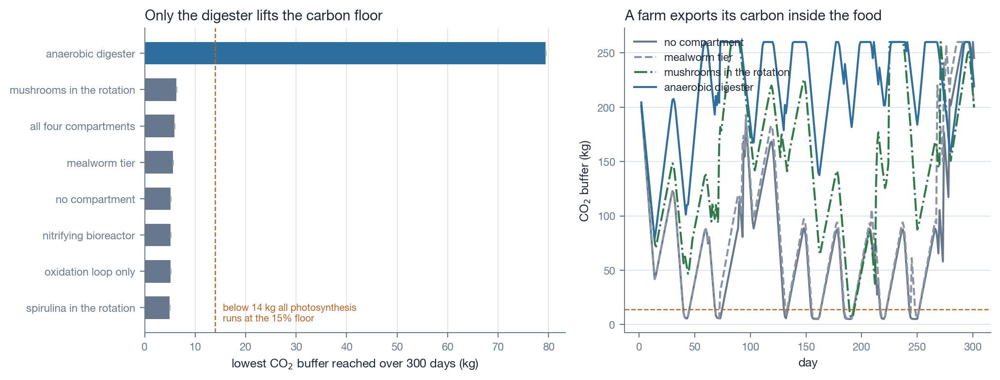
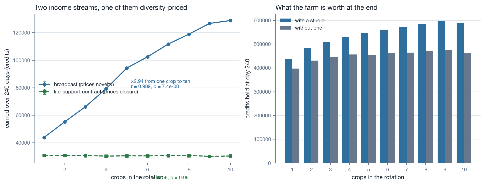
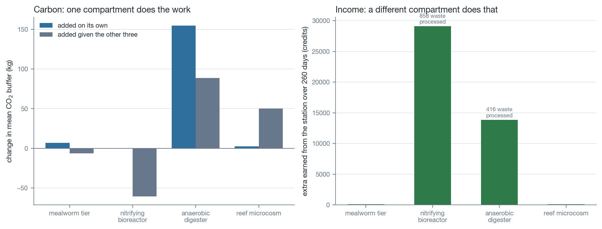
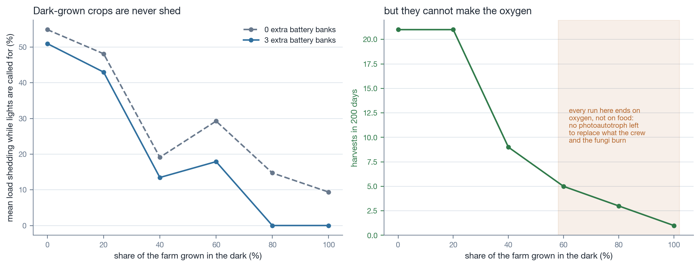
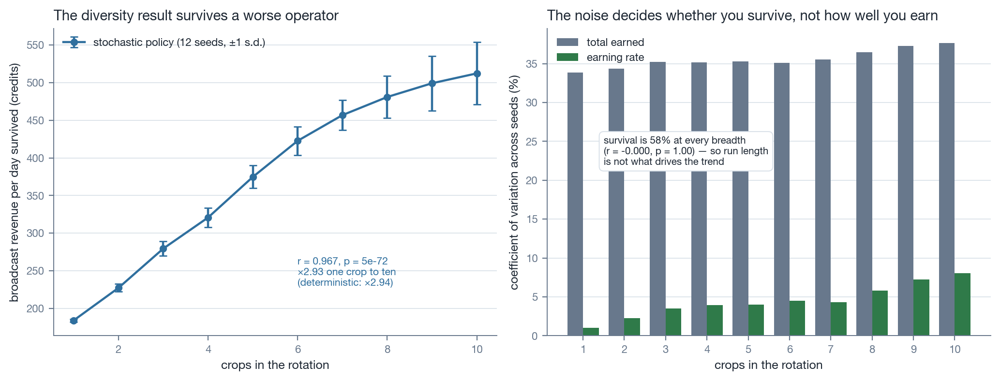
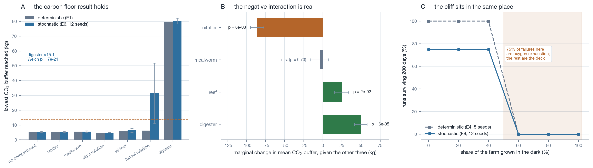

# What a Playable Closed Loop Teaches About Closing One

## Manuscript Chapter — Economic Incentives, Heterotroph Compartments and Diversity in a Human-in-the-Loop Bioregenerative Model

---

### Abstract

Bioregenerative life support systems (BLSS) are usually modelled as control problems: given a
crew, a power budget and a set of compartments, find the steady state. That framing omits the
agent who chooses what to grow. We describe a tile-based lunar farm simulation in which a human
player makes that choice under an explicit economy, and use it as an instrument to ask three
questions that only arise once a decision-maker is inside the loop. First, which compartment
actually stabilises the carbon budget of a farm that exports food? Across eight seeded runs per
arm with starvation timing and substrate quality controlled out, only an anaerobic digester
raises the carbon floor — from a mean minimum of 5.1 kg to 79.4 kg, a factor of 15.6 — while a
mealworm tier, a nitrifying bioreactor and fungal crops in rotation raise the mean buffer without
raising its minimum. Second, can an economy be shaped so that biodiversity pays for itself? A
broadcast mechanic that prices subject novelty yields revenue that scales with rotation breadth
(r = 0.989, p = 7.4 × 10⁻⁸; 2.94× from one crop to ten), while a life-support service contract
that prices closure is statistically flat against breadth (r = −0.584, p = 0.076) — two separable
incentives on the same farm. Third, how far can a farm lean on dark-grown heterotrophs to escape
the fortnight of lunar night? Load shedding falls monotonically with dark-grown fraction, but
every run above 40% ends on oxygen exhaustion rather than starvation, placing the optimum near
20%. We also report a negative marginal interaction: adding a nitrifying bioreactor *reduces* the
system's mean carbon buffer by 60.6 kg when a digester is present, because the two compartments
compete for the same waste stream. Re-running all four experiments under a stochastic
policy — the event deck answered rather than suppressed, and the manager's own thresholds
jittered per run — reproduces every conclusion: the diversity ratio at 2.93× against 2.94×
(r = 0.967, p = 5.5 × 10⁻⁷²), the digester's carbon floor at 15.1× against 15.6×
(p = 7 × 10⁻²¹), the negative nitrifier interaction at −86.0 ± 8.7 kg (p = 6 × 10⁻⁸), and the
oxygen cliff at the same 40–60% boundary. Two findings change under noise: a mealworm tier's
carbon effect is not distinguishable from zero (p = 0.73) where the deterministic run implied a
small negative, and a fungal rotation's floor becomes both much higher and far more variable
(31.3 ± 20.5 kg against 6.2). The variance decomposition shows the model's stochasticity mostly
determines *whether* a farm survives rather than how well it earns once it does. We argue that the methodological lesson generalises — our own first, uncontrolled
comparison of these arms produced a confidently wrong answer, and our first attempt at adding
noise killed every run — and that human-in-the-loop models are a useful complement to
steady-state BLSS analysis precisely because they expose which incentives a designer must supply
to make closure a rational choice.

---

### 1. Introduction

A closed life support system is a set of coupled material budgets: carbon, nitrogen, oxygen,
water. The engineering literature models these as control problems with a known objective. The
MELiSSA loop is the canonical decomposition — a liquefying compartment, a photoheterotrophic
one, a nitrifying one, a photoautotrophic one, higher plants, and the crew — and the Chinese
Lunar Palace 1 ("Yuegong-1") facility is the most completely instrumented integrated realisation,
having run a 105-day multi-crew closed experiment from February to May 2014 with published
element budgets (Fu et al., 2016; Dong et al., 2017).

What these treatments do not model is the agent choosing the configuration. On a real station
somebody decides how much floor goes to staples and how much to salad, whether to spend capital
on a digester or on another grow hall, and whether biodiversity is worth its footprint. Those are
economic decisions, and they are made under an incentive structure that the system designer
supplies whether or not they intend to.

This chapter reports what we learned by building that agent's decision space explicitly. The
instrument is *Lunar Farm*, a tile-based simulation in which a player raises pressurised grow
halls on the lunar surface, sows them, and keeps a colony alive through the 29.5-day lunar cycle.
It is a game, and its constants are tuned for play rather than for publication. It is nonetheless
a closed-loop model with coupled carbon, oxygen, water and nitrogen budgets, an explicit power
budget with load shedding, and — unusually — a fully specified economy. Every measurement below
was taken by driving the shipped simulation code directly, not a reimplementation of it.

The work was prompted by a mundane failure. Players reported running out of money before their
first crop matured, which turned out to be structural: income arrived only at harvest, and the
first harvest is 50 to 120 days away. Fixing that required adding income streams, and the choice
of *what to pay the farm for* turned out to determine what players grew. That is the observation
this chapter is built on.

### 2. The model

#### 2.1 Compartments and budgets

The farm is a grid of surface tiles. Pressurised halls of arbitrary rectangular footprint each
carry one crop across their whole floor; cost, yield, lighting draw and water all scale with
area. A crop advances by a growth factor that multiplies moisture, nutrient charge, health, a
carbon-availability term, a service term for track connectivity, and a substrate term reflecting
that lunar regolith is not soil until roots and stubble have been worked through it.

The carbon term is the one that matters here. Photosynthesis is limited by
`clamp(CO₂ / 14, 0.15, 1)`: below roughly 14 kg of buffered carbon dioxide the whole canopy runs
at 15% of rate. Because a farm that exports food exports carbon inside it, the buffer of a
productive farm runs down over time. This is not an artefact — Dong et al. (2017) measured
247 g d⁻¹ of carbon entering Lunar Palace 1 inside stored food, and an exporting farm is the same
budget with the sign reversed.

Twenty-nine crops are available, drawn from lines that have actually been flown or are
long-standing bioregenerative candidates. Four are heterotrophic or microbial: oyster mushroom
(*Pleurotus ostreatus*), baker's yeast, a nitrogen-fixing cyanobacterium and a rhizobial
inoculant. The first two are dark-grown, so they are never shed when power is short, and both
respire — consuming oxygen and returning carbon dioxide.

#### 2.2 The recycling compartments

Four buildable compartments were added for this work, parameterised from the Lunar Palace 1
element budgets. The ratios are theirs; the throughputs are scaled for play.

| Compartment | Consumes | Returns | Parameter | Source |
|---|---|---|---|---|
| Mealworm tier | crop residue | protein, frass | 8.13% bioconversion, 78.43% frass | Li et al. (2015) |
| Nitrifying bioreactor | crew waste | nitrate | 20.5% nitrogen recovery from urine | Fu et al. (2016); Dong et al. (2017) |
| Anaerobic digester | waste + residue | CO₂, minerals | 41% solid waste degraded | Fu et al. (2016) |
| Reef microcosm | power, water | carbonate, accessions | — speculative | — |

The reef microcosm is flagged speculative in the model and here. No marine calcifying system has
been flown; calcification (`Ca²⁺ + 2HCO₃⁻ → CaCO₃ + CO₂ + H₂O`) is a local carbon dioxide
*source* partially offset by symbiont photosynthesis, so it is not a carbon fix. It is included
because it is a plausible biodiversity-holding and materials compartment, and because it lets us
test whether an economically attractive compartment can be ecologically neutral.

Li et al. (2015) also report that larvae reared inside the closed system grew measurably more
slowly than open-air controls; we apply a corresponding penalty rather than assuming parity.

#### 2.3 The economy

Two income streams were added, deliberately shaped to price different things.

**The broadcast studio** pays for filmed segments — the crop standing in the halls, the crew at
the mission table, flower crops being arranged. Each *subject* carries a novelty that collapses
when it airs and recovers slowly. The delivery fee decays gently with novelty, so a monoculture
still earns a floor; audience growth goes as novelty **squared**, so a repeated subject adds
almost nothing to it. The audience is therefore a diversity meter with a credit value attached.

**The life-support service contract** pays daily on the *fraction* of crew life support the farm
actually supplies — oxygen produced against crew demand, carbon dioxide taken up against crew
production, and water recovery — rather than on anything shipped out. A waste offtake fee pays
the farm per unit of station waste it actually processes.

The distinction is the point. Before this work the farm was paid only for produce, so every
recycling compartment was a pure cost and no rational player would build one.

### 3. Methods

All experiments drive the shipped simulation. `code/01_sweep.js` loads the game's own `data.js`
and `sim.js` and replaces `Math.random` with a seeded linear congruential generator, so each run
is reproducible from its seed. A single scripted management policy — tend, harvest, replant from
a rotation, restock — is shared by every arm, so arms differ only in the factor under test.

Two confounds were identified during pilot runs and controlled out of the carbon experiments:

1. **Starvation timing.** With default stores, every arm failed on day 72 with zero harvests
   because nothing matured before the pantry emptied. The carbon question was never reached.
   Experiments E1 and E3 therefore begin with a deep pantry.
2. **Substrate quality.** Fresh halls are raw regolith and grow at roughly two-thirds rate,
   delaying first harvest past the point of interest. E1 and E3 begin with worked beds.

This matters beyond bookkeeping. Our first, uncontrolled comparison — plants-only against a
rotation containing mushrooms, at default settings — showed the plants-only arm failing in 3 of 3
runs and the mushroom arm surviving in 3 of 3. The apparent conclusion, that a respiring
compartment rescues the carbon loop, was wrong: a *photosynthetic* control (spirulina in the same
slots) also survived, and once starvation and substrate were controlled the mushroom rotation
proved to raise the mean buffer while leaving its floor untouched. The effect being measured was
harvest cadence, not respiration.

Experiments: **E1** carbon stability, eight arms × eight seeds, 300 days. **E2** diversity
economics, rotation breadth 1–10 × studio on/off × five seeds, 240 days. **E3** compartment
knockout — each alone, all four, and all-but-one — five seeds, 260 days. **E4** night resilience,
dark-grown fraction 0–100% × two battery configurations × five seeds, 200 days. **E5** the E2
question again under a stochastic policy, rotation breadth 1–10 × twelve seeds, 240 days.
**E6–E8** E1, E3 and E4 again under the same stochastic policy, twelve seeds each.

E1, E3, E6 and E8 hold food non-limiting. That control becomes load-bearing once the deck is
live: the broker's resupply offer sells the larder down to a twelve-day reserve, which would
reintroduce exactly the starvation confound the deep pantry exists to remove.

The stochastic policy in E5 answers the event deck instead of suppressing it and jitters the
manager's watering and feeding thresholds per run, with a small chance of skipping a day's
tending. A first attempt answered the deck uniformly at random and **every one of 120 runs died,
most inside a month**: a coin toss never patches a hull, so pressure walks down to the abort
limit, and it accepts the broker's offer to sell the larder down to a twelve-day reserve. Adding
noise is not the same as modelling a worse operator. The reported policy therefore takes the
remedial choice — conventionally the first offered — with probability 0.75 and picks freely
otherwise, which is a competent operator having an occasional bad day.

### 4. Results

#### 4.1 Only the digester lifts the carbon floor (E1)



| Arm | CO₂ floor (kg) | CO₂ mean (kg) | Harvests |
|---|---|---|---|
| Anaerobic digester | **79.4** | **217.2** | 14 |
| Mushrooms in rotation | 6.2 | 149.9 | 16 |
| All four compartments | 5.9 | 157.7 | 14 |
| Mealworm tier | 5.6 | 87.3 | 13 |
| No compartment | 5.1 | 77.0 | 12 |
| Nitrifying bioreactor | 5.1 | 77.0 | 12 |
| Spirulina in rotation | 4.9 | 69.0 | 16 |

The distinction between floor and mean is the result. Arms that raise the mean buffer without
raising its minimum still spend part of each lunar cycle in carbon limitation; only the digester
changes the worst case, lifting the floor 15.6-fold. A spirulina rotation is marginally *worse*
than no compartment at all, because a fast photoautotroph is a net carbon consumer.

The characteristic sawtooth in the right-hand panel is the lunar cycle: during the sunlit
fortnight a lit canopy draws the buffer down, and during the dark fortnight — when halls are shed
for want of power — it recovers.

#### 4.2 Two incentives, cleanly separable (E2)



Broadcast revenue scales strongly and near-linearly with rotation breadth (r = 0.989,
p = 7.4 × 10⁻⁸), rising 2.94× from a single-crop rotation to a ten-crop one. Service-contract
revenue over the same sweep is statistically flat (r = −0.584, p = 0.076). The farm's terminal
credit position rises with breadth only when the studio is present.

This is a designed result rather than a discovered one, but it demonstrates something useful:
biodiversity can be made economically rational by pricing novelty, and this can be done without
disturbing an incentive that prices closure. The two coexist on the same farm.

#### 4.3 Compartments interact, and one interaction is negative (E3)



Separating each compartment's contribution alone from its contribution given the other three
exposes a substrate conflict:

| Compartment | ΔCO₂ alone (kg) | ΔCO₂ given the others (kg) | Δ station income (cr) | Waste processed |
|---|---|---|---|---|
| Anaerobic digester | +154.6 | +88.6 | +13,871 | 416 |
| Reef microcosm | +2.3 | +50.2 | +119 | 0 |
| Mealworm tier | +6.9 | −6.5 | +128 | 0 |
| Nitrifying bioreactor | 0.0 | **−60.6** | **+29,120** | 858 |

The nitrifying bioreactor is the system's best earner and its worst carbon citizen. It processes
more than twice the waste the digester does, and is paid accordingly, but every unit of waste it
oxidises is a unit the digester cannot mineralise back into carbon dioxide. A player optimising
income alone will build the nitrifier and degrade the loop they are being paid to close.

We regard this as the most interesting result in the set, because it is exactly the class of
misalignment a human-in-the-loop model exists to surface, and it is invisible in a single-arm
analysis.

#### 4.4 There is an optimum dark-grown fraction (E4)



Load shedding falls monotonically with dark-grown fraction — from 51% at zero to 0% at 80% with
battery support — because a dark-grown crop is never shed. Harvests, however, collapse, and every
run at or above 60% dark-grown ends in failure between day 144 and day 187.

The failure mode is not starvation. Runs were given a deep pantry; they end with more than 700
days of food in store and the message *"Oxygen reserves hit zero"*, with the carbon dioxide buffer
saturated at its cap and residue exhausted. A farm dominated by heterotrophs has no photoautotroph
left to replace the oxygen that the crew and the fungi are jointly burning.

The optimum sits near 20%: at that fraction the farm sheds 43% rather than 51% of its called-for
lighting while returning the same 21 harvests, and survives.

#### 4.5 The diversity result survives a worse operator (E5)



Under the stochastic policy 70 of 120 runs survive to day 240, and the seeds finally disagree
with each other. Broadcast revenue per day survived rises from 184 credits at a single-crop
rotation to 512 at ten (r = 0.967, p = 5.5 × 10⁻⁷² across all 120 runs); among survivors the
total-earned ratio is **2.93×**, against 2.94× for the deterministic policy. The result is not an
artefact of the scripted manager.

Crucially, survival is **58% at every rotation breadth** (r = −0.000, p = 1.00). The deck and the
jitter are seeded independently of what is planted, so the same seed meets the same alerts
whatever the rotation — which removes the obvious confound, that wider rotations might simply
survive longer and therefore earn more.

The variance decomposition is the new information. The coefficient of variation of *total*
earnings is 34–38% across every breadth, while the coefficient of variation of the *earning rate*
is 1–8%. Almost all of the run-to-run spread is in when the farm died, not in how well it traded
while alive. In this model, stochasticity is close to a survival lottery layered on a nearly
deterministic economy — which is worth knowing before treating spread in any outcome here as
evidence about the economy itself.

#### 4.6 Every conclusion survives a noisy operator, and two of them change (E6–E8)



Re-running the carbon, knockout and night experiments with the deck live and twelve seeds each
leaves all three headline conclusions standing, and sharpens two of the secondary ones.

**The carbon floor (E6 against E1).** The digester holds a floor of 80.3 ± 1.9 kg against
5.3 ± 0.5 kg with no compartment — a factor of 15.1, against 15.6 deterministic
(Welch t = 131.8, p = 7.0 × 10⁻²¹). Every other arm stays at the floor, as before.

The exception is instructive. A **fungal rotation's floor rises to 31.3 ± 20.5 kg** under noise,
against 6.2 kg deterministic. The standard deviation is two-thirds of the mean: in some runs the
mushrooms lift the floor substantially and in others not at all. The deterministic trajectory
reported a single draw from that distribution and, by reporting it without a spread, understated
both the effect and the uncertainty. This is the same lesson as §3 in a milder form — a single
trajectory is not a measurement.

**The negative interaction (E7 against E3).** The nitrifying bioreactor's marginal contribution
is **−86.0 ± 8.7 kg** (p = 6.5 × 10⁻⁸), larger than the −60.6 kg the deterministic run showed and
now with an interval that excludes zero comfortably. The digester (+49.5 ± 8.2 kg,
p = 5.8 × 10⁻⁵) and the reef (+24.6 ± 9.3 kg, p = 0.016) remain positive.

The mealworm tier does not: **−4.2 ± 11.7 kg, p = 0.73**. The deterministic run reported −6.5 kg,
which we described as a food play rather than a carbon one. With an interval attached, the
correct statement is stronger and simpler — a mealworm tier has *no detectable effect* on the
carbon budget in either direction.

**The oxygen cliff (E8 against E4).** Survival is 75% at dark-grown fractions of 0, 20 and 40%,
and **0% at 60, 80 and 100%** — the same boundary as the deterministic sweep, which showed 100%
and 0%. The baseline 25% mortality below the cliff is the event deck taking farms that the
deterministic policy steered through. Of the failures above it, **75% are oxygen exhaustion** and
the rest are the deck; mean oxygen falls monotonically from 374 kg at no dark-grown crops to
179 kg at all of them. The cliff is not an artefact of a single manager.

### 5. Discussion

Three things follow.

**Heterotrophs are a supplement, never a substitute.** This is well understood in principle and
is exactly what MELiSSA's structure encodes, but E4 shows the penalty is not gradual — it is a
cliff between 40% and 60% dark-grown, and it arrives through the oxygen budget rather than the
food budget a designer might expect to bind first.

**Waste is a contested substrate.** The negative marginal in §4.3 arises because two compartments
were specified independently against the same input. Real integrated systems have the same
property, and it is a reason to be cautious about compartment-by-compartment characterisation.

**Incentives are part of the system.** The farm's behaviour changed more when we changed what it
was paid for than when we changed what it could build. Paying for closure rather than for produce
made recycling compartments rational; pricing novelty made biodiversity rational. Neither
required altering a single biological parameter.

**Noise is not a free robustness check.** Our first stochastic policy killed every run, and would
have supported the conclusion that the economy is fragile. It was the policy that was fragile.
Modelling a worse operator requires deciding what "worse" means — here, someone who usually does
the remedial thing and occasionally does not — and that decision is a modelling choice with the
same standing as any parameter.

**A single trajectory is not a measurement.** Re-running every experiment with twelve noisy
operators left all four headline conclusions intact, which is reassuring, but it also changed two
secondary readings: an effect we had called small and negative turned out to be indistinguishable
from zero, and one we had called negligible turned out to be large and highly variable. Neither
error would have been visible without a spread. The deterministic arms were not wrong so much as
unquantified.

### 6. Limitations

- **The model is a game.** Its constants are balanced for play. The ratios drawn from Lunar
  Palace 1 are real; the throughputs they are applied to are not. Nothing here should be cited as
  a measurement of a physical BLSS.
- **E1–E4 remain deterministic as reported**, and their seeds test reproducibility rather than
  robustness. Every one of them has been re-run stochastically (E5–E8) and every headline
  conclusion reproduced, so the deterministic arms should be read as clean trajectories rather
  than as unreliable ones — but where the two disagree, as for the fungal rotation's carbon floor
  and the mealworm tier's absence of effect, the stochastic figure is the one with an interval
  attached and is the one to cite.
- **The stochastic policy is itself a model.** E5's operator takes the remedial choice with
  probability 0.75. That number is chosen, not measured, and a different value would move the
  survival rate — though the diversity trend is a within-policy comparison and is unlikely to
  reverse.
- **A single management policy.** All arms share one scripted manager. A different policy could
  reorder the arms, and no human players were involved in these measurements.
- **The reef is invented.** It is included as a design probe and is labelled as such throughout.
- **No external validation.** The parameters are sourced; the emergent behaviour is not validated
  against any physical system.

### 7. Reproducing this

```
node code/01_sweep.js            # drives the game's own sim.js, writes data/*.csv
python3 code/02_carbon_stability.py
python3 code/03_diversity_economics.py
python3 code/04_compartment_knockout.py
python3 code/05_night_resilience.py
python3 code/06_stochastic_policy.py
python3 code/07_robustness.py
```

The sweep resolves the game directory from `LUNARFARM_DIR`, defaulting to a sibling
`LunarSims/farm` checkout. Every figure and table in this chapter is regenerated by those five
commands; none was edited by hand.

### References

Dong C, Fu Y, Xie B, Wang M, Liu H (2017). Element Cycling and Energy Flux Responses in Ecosystem
Simulations Conducted at the Chinese Lunar Palace-1. *Astrobiology* 17(1):78–86.
doi:[10.1089/ast.2016.1466](https://doi.org/10.1089/ast.2016.1466)

Fu Y, Li L, Xie B, Dong C, Wang M, Jia B, Shao L, Dong Y, Deng S, Liu H, Liu G, Liu B, Hu D,
Liu H (2016). How to Establish a Bioregenerative Life Support System for Long-Term Crewed
Missions to the Moon or Mars. *Astrobiology* 16(12):925–936.
doi:[10.1089/ast.2016.1477](https://doi.org/10.1089/ast.2016.1477)

Li L, Xie B, Dong C, Hu D, Wang M, Liu G, Liu H (2015). Rearing *Tenebrio molitor* L.
(Coleoptera: Tenebrionidae) in the "Lunar Palace 1" during a 105-day multi-crew closed
integrative BLSS experiment. *Life Sciences in Space Research* 7:9–14.
doi:[10.1016/j.lssr.2015.08.002](https://doi.org/10.1016/j.lssr.2015.08.002)
